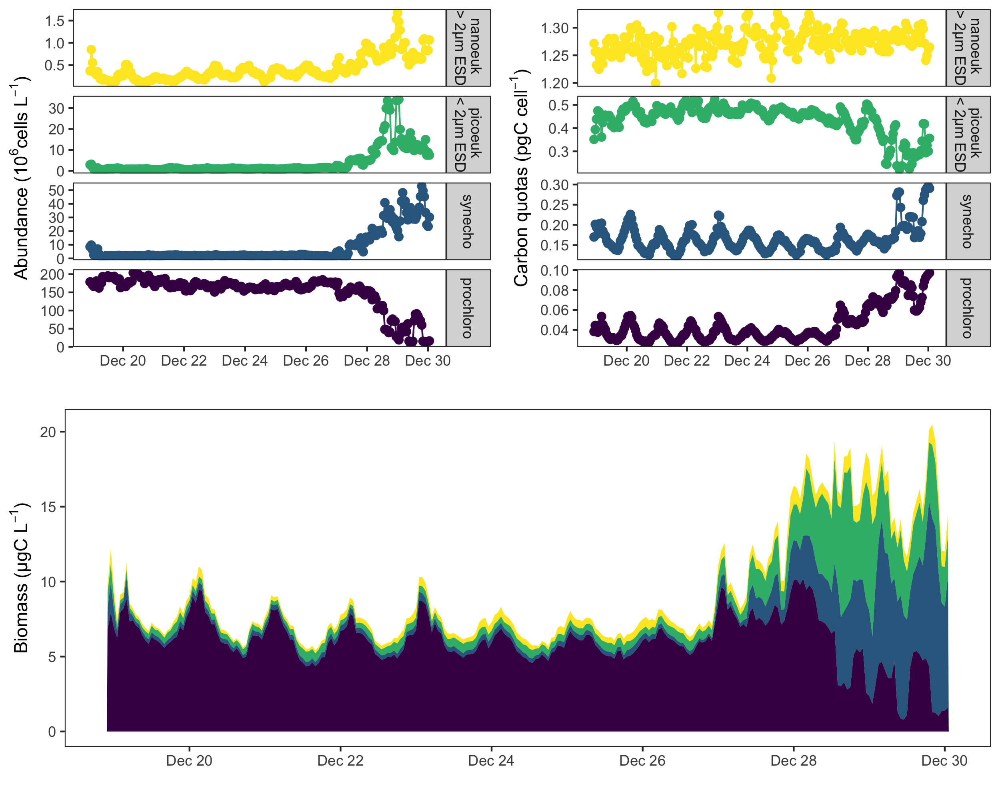
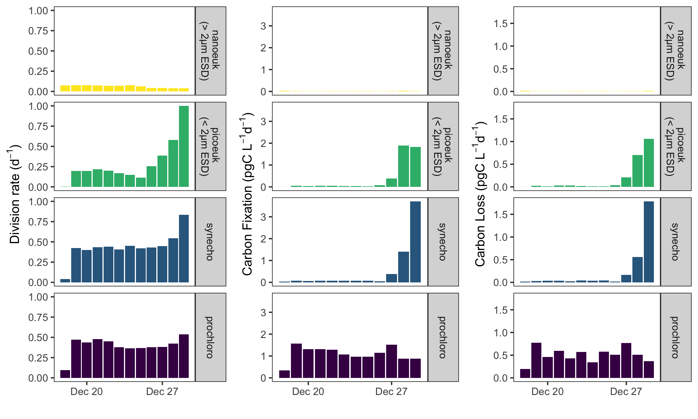

We produce high-resolution datasets of marine phytoplankton communities through SeaFlow continuous sampling. These datasets include instantaneous measurements and process rates, and are available through Zenodo public repository. Examples of our SeaFlow data products include:
- Abundance, size, carbon content and biomass data: [https://doi.org/10.5281/zenodo.2678021](https://doi.org/10.5281/zenodo.2678021). 
- Daily rates of cell division, carbon fixation and carbon loss: [https://doi.org/10.5281/zenodo.2678021](https://doi.org/10.5281/zenodo.2678021).

For real-time and historical SeaFlow data, explore our interactive dashboard: [seaflowcruise.org](https://gradientscruise.org/d/TN440-ByTime/tn440-by-time?orgId=1)

  
 
     
    <figcaption style="font-size: 0.8em;"><strong>Figure 1.</strong> SeaFlow state estimates during a Pacific Ocean transect (December 2019). Upper panels show abundance (left) and carbon quotas (right) for four phytoplankton populations: nanoeukaryotes (yellow), picoeukaryotes (green), Synechococcus (blue), and Prochlorococcus (purple). Lower panel displays total phytoplankton biomass with color-coded contributions from each population.</figcaption>
  

 

  
 
     
    <figcaption style="font-size: 0.8em; "><strong>Figure 2.</strong> SeaFlow rate estimates from size-structured matrix population models during a Pacific Ocean transect. Left panels show daily division rates, middle panels display carbon fixation rates, and right panels present carbon loss rates for each population.</figcaption>
  

